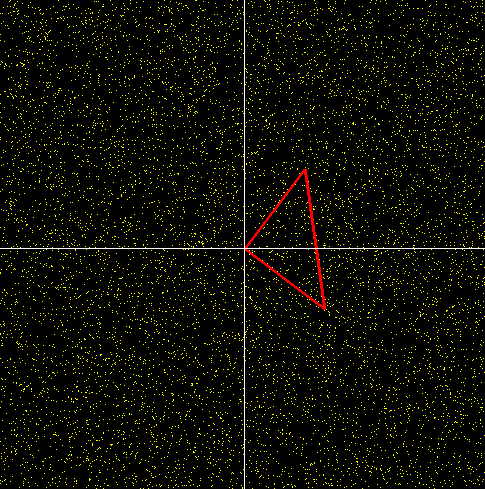
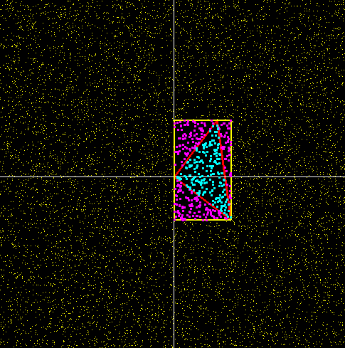

# Forca-Bruta-OpenGL

Este repositório contém um projeto desenvolvido como parte de um trabalho da faculdade. O projeto utiliza o Xcode com a biblioteca OpenGL para criar uma aplicação interativa em que o usuário controla um triângulo sobre uma área com vários pontos. O objetivo do trabalho é implementar o algoritmo de força bruta para calcular quantos pontos estão dentro do triângulo controlado pelo usuário.

## Pré-requisitos

- Xcode
- Biblioteca OpenGL

## Exemplos de imagens

Aqui estão duas imagens que ilustram o funcionamento da aplicação:

1. **Imagem com todos os pontos:**

Nessa imagem, é possível ver a área com vários pontos antes de qualquer cálculo ser realizado.

2. **Imagem com os pontos pintados dentro do triângulo:**

Nessa imagem, os pontos que estão dentro do triângulo são destacados em alguma forma de pintura.
